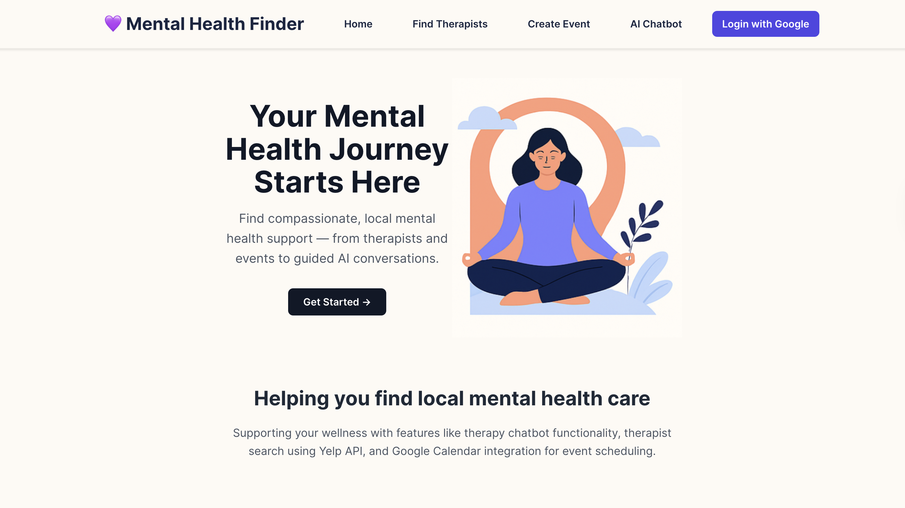
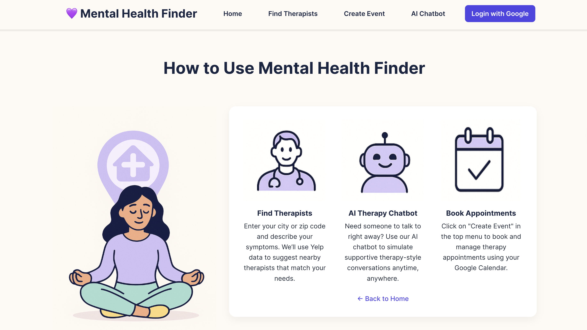
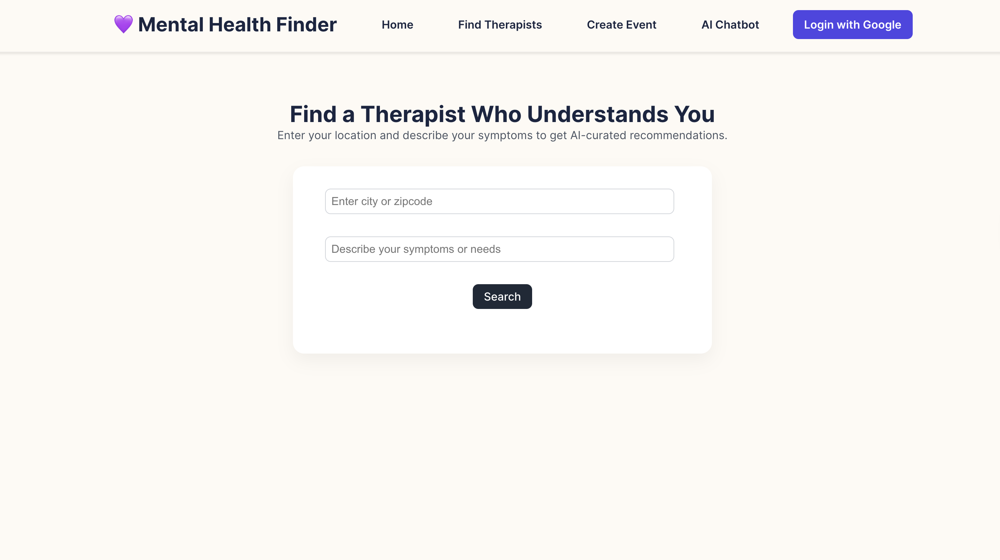
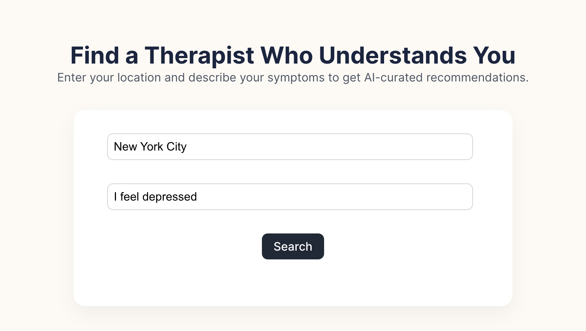
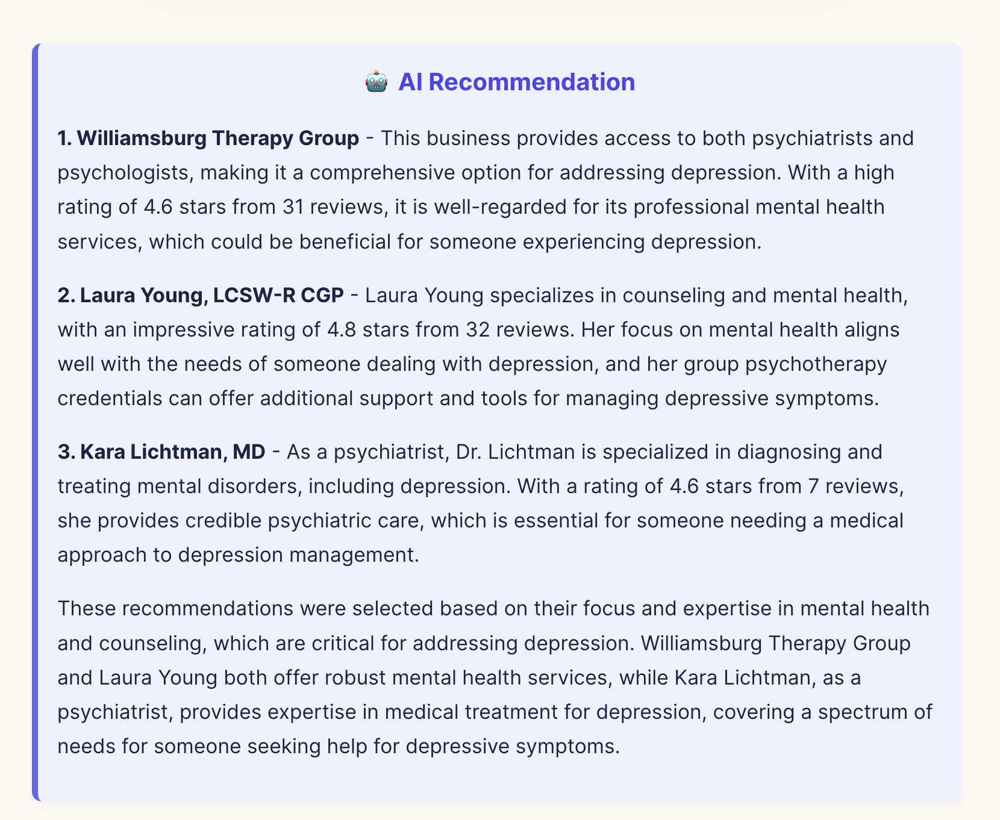
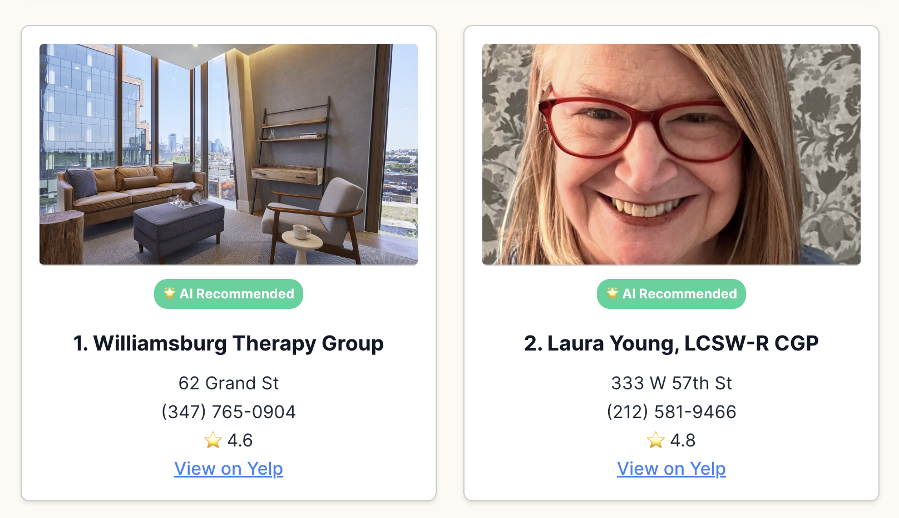
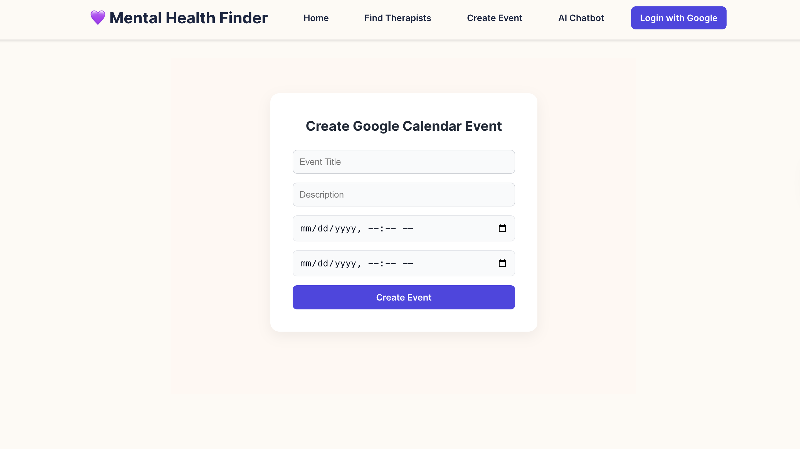
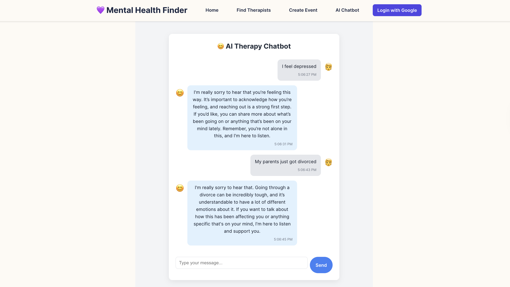

# 🧠 Local Mental Health Finder

[](LICENSE)
[](https://reactjs.org/)
[](https://expressjs.com/)
[](https://platform.openai.com/)
[](https://developers.google.com/calendar)
[](https://www.yelp.com/developers/documentation/v3)

**Local Mental Health Finder** is a full-stack web application that helps users find local therapists based on their symptoms and location, book appointments through Google Calendar, and chat with an AI-powered mental health assistant powered by OpenAI.

This project was built with empathy, accessibility, and practical utility in mind—bringing together real-time search, calendar scheduling, and intelligent conversation into one platform for mental health support.

---

## 🚀 Features

- 🔍 Therapist search using the **Yelp Fusion API**
- 📅 Google Calendar event creation with **OAuth2**
- 🔐 Google login & authentication
- 💬 AI chatbot powered by **OpenAI GPT**
- 🌍 Fully connected frontend/backend + deployment

---

## 🧑‍💻 Tech Stack

| Layer      | Tools & Services                      |
| ---------- | ------------------------------------- |
| Frontend   | React.js, Tailwind CSS                |
| Backend    | Node.js, Express                      |
| AI         | OpenAI GPT                            |
| APIs       | Yelp Fusion API, Google Calendar API  |
| Auth       | Google OAuth2                         |
| Deployment | Firebase (Frontend), Render (Backend) |

---

## 📁 Project Structure

```
local-mental-health-finder/
├── backend/
│   ├── routes/
│   │   ├── auth.js
│   │   ├── calendar.js
│   │   └── yelp.js
│   └── server.js
├── frontend/
│   ├── src/components/
│   │   ├── TherapistCard.jsx
│   │   ├── AIChatbot.jsx
│   │   ├── EventForm.jsx
│   │   └── Navbar.jsx
│   ├── App.jsx
│   └── ...
├── .firebase/
├── .github/workflows/
├── firebase.json
├── .firebaserc
├── .env.example
└── README.md
```

---

## 🔗 Deployed Application

Try the live app here:  
🌐 [https://local-mental-health-find-96e8c.web.app](https://local-mental-health-find-96e8c.web.app)

---

## 🧪 Getting Started

### 1. Clone the repository

```bash
git clone https://github.com/mmjsk0805/local-mental-health-finder.git
cd local-mental-health-finder
```

### 2. Add environment variables

#### `/backend/.env`

```env
GOOGLE_CLIENT_ID=your-google-client-id
GOOGLE_CLIENT_SECRET=your-google-client-secret
GOOGLE_REDIRECT_URI=https://your-backend.com/oauth2callback
YELP_API_KEY=your-yelp-api-key
OPENAI_API_KEY=your-openai-api-key
FRONTEND_BASE_URL=https://your-frontend.com
```

#### `/frontend/.env`

```env
VITE_BACKEND_URL=https://your-backend.com
```

### 3. Install dependencies

```bash
cd backend
npm install
cd ../frontend
npm install
```

### 4. Run the application locally

```bash
# In one terminal
cd backend
npm run dev

# In another terminal
cd frontend
npm run dev
```

Then open `http://localhost:5173` in your browser.

---

### 🧭 How to Use the Application

When users visit the **Local Mental Health Finder**, they’re greeted with a clean, calming homepage and a simple navigation bar. Scrolling down, they land on the **“Get Started”** section, which provides a step-by-step guide for using the app. This page is designed to reduce friction and anxiety by showing users exactly what to expect—from entering symptoms to booking a session or chatting with the AI.

From there, users can either **search for therapists** or **chat with the AI assistant**:

- On the **“Find Therapists”** page, users enter their **location** and **briefly describe their symptoms** (e.g., “I feel anxious” or “I’m burned out”). The app then uses the **Yelp Fusion API** to display nearby therapists who match those needs. Each listing includes real reviews and contact information so users can make informed decisions.

- When ready to take the next step, users visit the **“Create Event”** page. After signing in with **Google OAuth**, they can instantly book a mental health appointment and have it synced to their **Google Calendar** with proper timezone detection.

- Alternatively, users can choose the **AI Chatbot**, a friendly, private conversational interface powered by **OpenAI GPT**. This space is ideal for those who want to express what they’re feeling without pressure. The chatbot responds with warmth, structure, and language that supports reflection and self-understanding.

All features are built with user-centered design and accessibility in mind, ensuring a smooth experience for people in emotionally vulnerable moments.

---

## 📷 Screenshots

### 🏠 Home Page



### 💡 Get Started Section



### 🧑‍⚕️ Search Input Page



### 🔍 Filled Search Example



### 🤖 AI Recommendations



### 📋 Yelp Therapist Results



### 📅 Create Event Page



### 💬 Chatbot Interface



---

## 🧭 Learning Journey

### 💡 What inspired you to create this project?

This project grew from a recurring question I’ve seen too many people struggle with: _“I think I need help, but where do I start?”_ Whether it’s a student battling burnout or someone quietly carrying anxiety or depression, the first step toward seeking mental health support is often the hardest. I wanted to make that step feel less overwhelming, more guided, and accessible.

At Dartmouth, I’ve seen peers hesitate—not because they didn’t want help, but because they didn’t know how to navigate the process: searching for therapists, understanding what services are available, and scheduling appointments all while trying to stay afloat academically or emotionally. That observation became my design brief: **build something that bridges the emotional and logistical gap between needing help and getting it**.

The inspiration wasn’t just technical—it was deeply human. I wanted to build a space that felt calming, clear, and supportive, even before a user spoke to another person. That meant merging real-world functionality (finding a therapist, booking an appointment) with compassionate AI support when human connection wasn’t immediately available.

---

### 🌍 What potential impact do you believe it could have on its intended users or the broader community?

**Local Mental Health Finder** aims to be more than just a directory or chatbot—it’s designed to be a _first step_. For someone unsure of where to turn, it provides immediate, understandable options: therapists in their area based on symptoms, calendar-based scheduling to reduce procrastination, and an AI-powered space to reflect, vent, or get initial guidance.

In a broader context, I believe this model could serve as a digital triage tool for mental health ecosystems. It can be extended to schools, community centers, or public health networks—anywhere that people might need help but lack immediate access. By combining data-driven resources with empathetic conversational UX, it brings warmth and immediacy to a space often dominated by sterile, bureaucratic forms.

The app’s potential lies in how it humanizes mental health access—not by replacing therapy, but by **reducing barriers** and reminding users that support is near, and they’re not alone.

---

### 🧠 What new technologies did you learn?

Throughout this project, I explored tools that pushed my boundaries both as a developer and as a designer:

- **Google OAuth 2.0 + Calendar API**: I learned how to securely authenticate users, handle token exchanges, and create real-time events on their calendar. This gave me practical experience building trust-driven flows essential in apps handling sensitive use cases.
- **Yelp Fusion API**: This taught me how to fetch, parse, and personalize real-world data. I learned how to build filtered search systems, handle pagination, and work with external business review platforms to serve actual users.
- **OpenAI GPT API**: This was my first time working with generative AI in production. I learned prompt design, context injection, and how to balance creativity with control to generate supportive, relevant dialogue.
- **Tailwind CSS**: I improved my frontend design fluency, learning to implement accessible and responsive UIs quickly without sacrificing aesthetics or usability.
- **Firebase Hosting + Render Deployment**: I learned how to separate frontend and backend deployments, manage environment-specific secrets, and troubleshoot CORS and authentication issues.

---

### ⚙️ Why did you choose these technologies?

I chose each of these tools based on their **real-world reliability**, **developer support**, and **alignment with user needs**:

- **Google OAuth** ensured secure login flows, vital for a project dealing with user calendars and potentially personal data.
- **Yelp** provided authentic, location-based therapist listings with public trust indicators (like reviews), which helped build user confidence.
- **OpenAI** allowed me to create emotionally aware chatbot interactions without needing a full custom language model. It also gave me room to experiment with human-centric prompting.
- **Tailwind** helped me implement a clean, modern design system that was easy to iterate on—especially important for making the app visually welcoming and uncluttered.
- **Firebase & Render** enabled low-friction deployment pipelines, CI/CD workflows, and a clearly separated architecture that mirrors professional best practices.

These technologies weren’t just chosen for functionality—they were chosen to reflect a real-world build process and to reinforce user trust.

---

### 🧩 What challenges did you face, and what did you learn from the experience?

#### 1. **OAuth Flow + Token Management**

Setting up Google OAuth across development and production environments was difficult. I ran into redirect URI mismatches and invalid grant errors. But solving those issues taught me to **read API docs deeply**, understand OAuth flows, and debug requests at the network level. More importantly, it taught me patience—and the value of documentation.

#### 2. **Prompt Engineering with GPT**

Making the chatbot sound helpful, not robotic or vague, was a significant design challenge. I learned that prompt engineering is not just about tokens and temperature—it’s about **intentional voice and tone**. I iterated prompts dozens of times to strike the right emotional register, and it was one of the most creatively technical parts of the project.

#### 3. **API Integration Across Frontend/Backend**

I had to learn how to **secure API keys**, handle asynchronous data flows across components, and manage rate limits with Yelp and OpenAI. I also had to prevent exposure of sensitive credentials, which improved my understanding of .env files, CORS headers, and production security.

#### 4. **Designing for Vulnerable Users**

This was the most meaningful lesson. When designing for users who may be overwhelmed, anxious, or in emotional distress, **every interface decision matters**—spacing, color, copy tone, and button clarity. I chose cheerful but soft colors, gentle microcopy, and simplified interactions to ensure the app felt like a place of comfort, not confusion.

---

### 💬 Reflection

This wasn’t just a technical project—it was a **product with purpose**. It challenged me to think about how software can care. DALI values the kind of learning that doesn’t stop at the code—and this project was exactly that. I had to step up, adapt constantly, work across unfamiliar tools, and care deeply about how people would feel while using what I built.

If there's one takeaway, it's this: building tech for mental health isn't just about getting things to work—it's about getting things to feel right.

---

## 📄 License

MIT License  
© 2025 [Jaden Moon](https://github.com/mmjsk0805)
